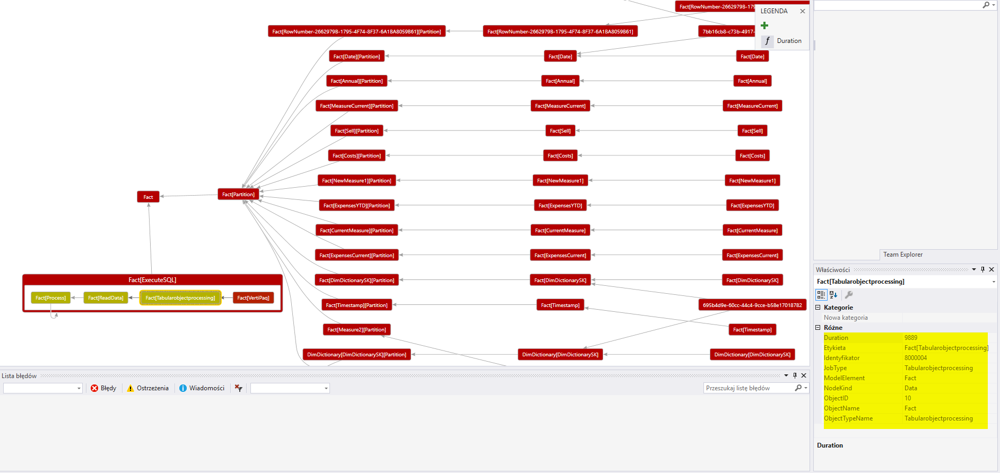

# Tabular-processing-graph-from-extended-events-XEL-file
Generate tabular processing DGML graph based on extended events XEL file

## What for
Brakdown tabular processing job into sigle processes to analyze bottlenecs 

## How use this simple code
1. Open SSMS 
2. Connect to your tabluar instance
3. Open and execute XMLA extended-event-query-template.XMLA (provide path where XEL file will be stored)
4. Star processing your tabular cube (full, table)
5. In SSMS open file "Generate DGML graph.sql" (provide path where XEL file has been stored)
6. Copy all rows from "Result" tab and save them to .DGML file
7. Open Visual Studio -> open your DGML file (you need to install DGML extension to Visual Studio from Visual Studio Installer)
8. Have fun with DGML graph

